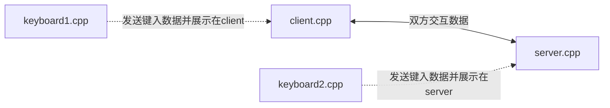

## 《软件网络设计》项目二 2022/10/18

”自由聊天“实现

存在两个阻塞：1.recv() 2.scanf()

1.采用select的方法，在readfd状态队列里面的才读取

2.开辟一个新的线程，新建一个本地client，工作是从键盘读入数据，发送给聊天主程序。由聊天主程序转发消息，并显示聊天内容。

实现流程如下：

keyboard：连接，循环（获取键入信息，发送，“exit”退出）

套接字连接规则

client：s套接字监听keyboard连接，sock套接字连接server.

server：socket_list.Keyboardsock轮询监听keyboard连接，  //////////socket_list.Mainsock轮询监听多个client连接.

